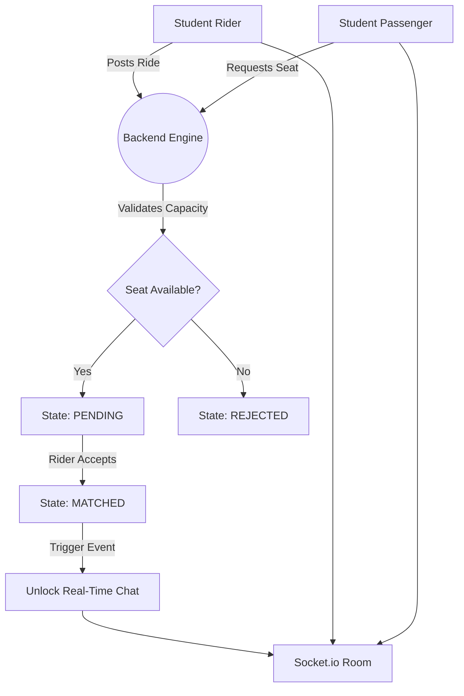

# Crewmute | Campus Mobility Network

**The campus carpool app for Indian college students.**  
Post a ride. Find your crew. Split the fare.

---

## 🌟 Vision & Impact

Every weekend, thousands of Indian college students travel home via shared cabs and spend hours coordinating through fragmented WhatsApp groups. Crewmute replaces that chaos with a dedicated, closed-network platform. Verified students can seamlessly post or browse intercity rides, request seats, and coordinate through real-time in-app chat.

### Core Value Proposition
- **Closed-Loop Security:** Strict college-email OTP verification ensuring rides are only shared among verified peers.
- **Real-Time Logistics:** Socket.io powered instant messaging that unlocks automatically upon a matched ride request.
- **State-Machine Ride Tracking:** Automated lifecycle management where rides expire instantly upon departure and seat counts adjust dynamically.
- **Enterprise Observability:** Built-in Prometheus metrics and Pino structured logging for high-availability tracking.

### System Topography & State Machine

---

## 🛠️ Architecture Highlights

- **Mobile Application**: React Native 0.81, Expo SDK 54, Expo Router v6, NativeWind 4, Zustand 4.
- **Backend Services**: Node.js 20 LTS, Express 4, TypeScript 5, MongoDB 7 + Mongoose 8.
- **Real-Time Engine**: Socket.io 4 for low-latency 1:1 messaging and read-receipts.
- **Infrastructure**: Railway, MongoDB Atlas, Cloudinary, GitHub Actions CI, Expo EAS.
- **Security & Auth**: Custom college-domain JWT flow (15m access / 7d refresh), bcrypt hashing (12 rounds).
- **Design System**: Full light/dark mode support, WCAG 2.1 AA contrast compliance, 44pt touch targets.

---

## 📖 Documentation Ecosystem

| Document | Description |
|---|---|
| [**PRD.md**](PRD.md) | Product requirements, core personas, and detailed feature scoping. |
| [**ARCHITECTURE.md**](ARCHITECTURE.md) | Deep-dive into the system design, layered responsibilities, and API reference. |
| [**DESIGN.md**](DESIGN.md) | The Crewmute design system, encompassing tokens, components, and UX patterns. |
| [**docs/DECISIONS.md**](docs/DECISIONS.md) | Architectural Decision Records (ADRs) tracking engineering choices. |
| [**SECURITY.md**](SECURITY.md) | Security policies, JWT architectures, and vulnerability management. |

---

## 📄 License & Copyright

**All Rights Reserved.**

This project represents proprietary source code built for portfolio showcase purposes.  
*Built by Pahul · Amity University Punjab.*
